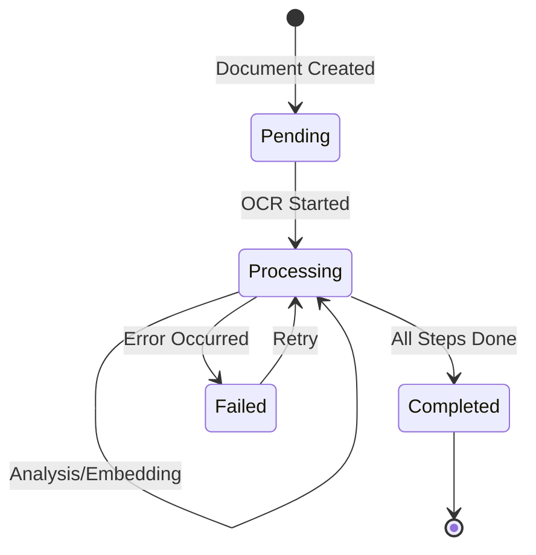

# Document Ingestion Pipeline

This flowchart illustrates the complete document processing pipeline in BlueRobin, from initial upload through OCR, analysis, embedding, and indexing.

## Pipeline Overview

```mermaid
flowchart TB
    subgraph Upload["📤 Upload Phase"]
        A[User uploads document] --> B{Validate file}
        B -->|Invalid| B1[Return error]
        B -->|Valid| C[Calculate fingerprint<br/>SHA256]
        C --> D{Duplicate check}
        D -->|Exists| D1[Return existing doc]
        D -->|New| E[Store in MinIO<br/>bucket: env-userId]
        E --> F[Create Document entity<br/>Status: Pending]
        F --> G[Publish: documents.uploaded]
    end

    subgraph OCR["🔍 OCR Phase"]
        G --> H[OcrEventConsumer<br/>subscribes]
        H --> I[Send to Docling OCR<br/>service]
        I --> J{Extraction<br/>successful?}
        J -->|No| J1[Retry with backoff<br/>max 3 attempts]
        J1 -->|Failed| J2[Mark: Failed<br/>Publish: documents.failed]
        J -->|Yes| K[Store text in MinIO<br/>processed/docId/content.md]
        K --> L[Update document<br/>Status: Processing]
        L --> M[Publish: documents.ocr.completed]
    end

    subgraph Analysis["🧠 Content Analysis Phase"]
        M --> N[AnalysisEventConsumer<br/>subscribes]
        N --> O[Generate via Ollama LLM]
        
        subgraph AnalysisTasks["Parallel Analysis"]
            O --> O1[Summary<br/>extraction]
            O --> O2[Keywords<br/>extraction]
            O --> O3[Friendly name<br/>generation]
        end
        
        O1 & O2 & O3 --> P[Update DocumentAnalysis<br/>value object]
        P --> Q[Publish: documents.analysis.completed]
    end

    subgraph Chunking["✂️ Chunking Phase"]
        Q --> R[DocumentChunkingWorker<br/>subscribes]
        R --> S[Semantic chunking<br/>max 512 tokens]
        S --> T[For each chunk:<br/>Publish chunk.created]
    end

    subgraph Embedding["🔢 Embedding Phase"]
        T --> U[EmbeddingFanoutWorker<br/>subscribes]
        U --> V[Fan out to 8 models]
        
        subgraph Models["Parallel Embedding Models"]
            V --> V1[nomic-embed-text]
            V --> V2[mxbai-embed-large]
            V --> V3[snowflake-arctic]
            V --> V4[bge-large-en]
            V --> V5[granite-embedding]
            V --> V6[bge-m3]
            V --> V7[all-minilm]
            V --> V8[paraphrase-multilingual]
        end
        
        V1 & V2 & V3 & V4 & V5 & V6 & V7 & V8 --> W[ChunkEmbeddingWorker<br/>per model]
        W --> X[Generate vectors<br/>via Ollama]
        X --> Y[Store in Qdrant<br/>collection per model]
        Y --> Z[Publish: embeddings.model.completed]
    end

    subgraph Aggregation["📊 Aggregation Phase"]
        Z --> AA[EmbeddingAggregatorWorker<br/>subscribes]
        AA --> AB{All 8 models<br/>completed?}
        AB -->|No| AC[Wait for remaining]
        AB -->|Yes| AD[Publish: documents.embeddings.completed]
    end

    subgraph EntityExtraction["🏷️ Entity Extraction Phase"]
        AD --> AE[EntityExtractionConsumer<br/>subscribes]
        AE --> AF[Send to Spacy NER<br/>service]
        AF --> AG[Extract entities:<br/>PERSON, ORG, DATE, LOC]
        AG --> AH[Store in PostgreSQL<br/>canonical_entities table]
        AH --> AI[Publish: documents.entities.extracted]
    end

    subgraph GraphSync["🕸️ Graph Sync Phase"]
        AI --> AJ[GraphSyncConsumer<br/>subscribes]
        AJ --> AK[Sync to FalkorDB<br/>knowledge graph]
        AK --> AL[Create relationships<br/>between entities]
        AL --> AM[Publish: documents.graph.synced]
    end

    subgraph Classification["📁 Classification Phase"]
        AM --> AN[DocumentClassificationWorker<br/>subscribes]
        AN --> AO[Classify via LLM<br/>into categories]
        AO --> AP[Update DocumentClassification<br/>value object]
        AP --> AQ[Mark: Completed<br/>Publish: documents.classified]
    end

    subgraph Notification["🔔 Notification Phase"]
        AQ --> AR[NatsDocumentEventListener<br/>in Blazor Web]
        AR --> AS[Update UI in real-time<br/>via component state]
        AS --> AT[✅ Document ready<br/>for search]
    end

    style Upload fill:#e3f2fd
    style OCR fill:#fff3e0
    style Analysis fill:#f3e5f5
    style Chunking fill:#e8f5e9
    style Embedding fill:#fce4ec
    style Aggregation fill:#e0f2f1
    style EntityExtraction fill:#fff8e1
    style GraphSync fill:#f1f8e9
    style Classification fill:#e8eaf6
    style Notification fill:#e0f7fa
```

## Processing States

## NATS Event Flow

| Subject | Publisher | Consumer | Payload |
|---------|-----------|----------|---------|
| `archives.documents.uploaded` | API | OcrEventConsumer | DocumentId, FileName, Bucket |
| `archives.documents.ocr.completed` | OcrWorker | AnalysisEventConsumer | DocumentId, TextLength |
| `archives.documents.analysis.completed` | AnalysisWorker | ChunkingWorker | DocumentId, Summary, Keywords |
| `archives.documents.chunks.created` | ChunkingWorker | EmbeddingFanout | ChunkId, Text, Index |
| `archives.embeddings.{model}` | EmbeddingFanout | ChunkEmbeddingWorker | ChunkId, ModelId |
| `archives.embeddings.{model}.completed` | ChunkEmbeddingWorker | EmbeddingAggregator | DocumentId, ModelId |
| `archives.documents.embeddings.completed` | EmbeddingAggregator | EntityExtraction | DocumentId |
| `archives.documents.entities.extracted` | EntityExtraction | GraphSyncConsumer | EntityIds[] |
| `archives.documents.graph.synced` | GraphSync | ClassificationWorker | DocumentId |
| `archives.documents.classified` | ClassificationWorker | Blazor Listener | DocumentId, Category |

## Error Handling

- **Retry Policy**: Exponential backoff with max 3 retries
- **Dead Letter Queue**: Failed messages after retries
- **Idempotency**: Each worker checks if step already completed
- **Compensation**: Failed status allows manual retry via UI
