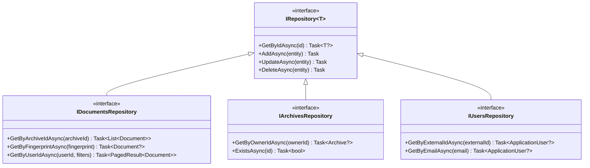

# Domain Model

This diagram illustrates the Domain-Driven Design (DDD) model in BlueRobin, showing aggregates, entities, value objects, and their relationships.

## Aggregate Structure

## Value Objects

## Document Aggregate Detail

## Domain Events

## Repository Interfaces

## Key DDD Patterns Used

| Pattern | Implementation | Example |
|---------|---------------|---------|
| **Aggregate Root** | `AggregateRoot` base class | Document, Archive |
| **Value Object** | Immutable records | BlueRobinId, FingerPrint |
| **Domain Event** | Event sourcing | DocumentAddedEvent |
| **Factory Method** | Static `Create()` methods | `Document.Create(...)` |
| **Repository** | Interface per aggregate | IDocumentsRepository |
| **Specification** | Search filters | SearchFilters |
