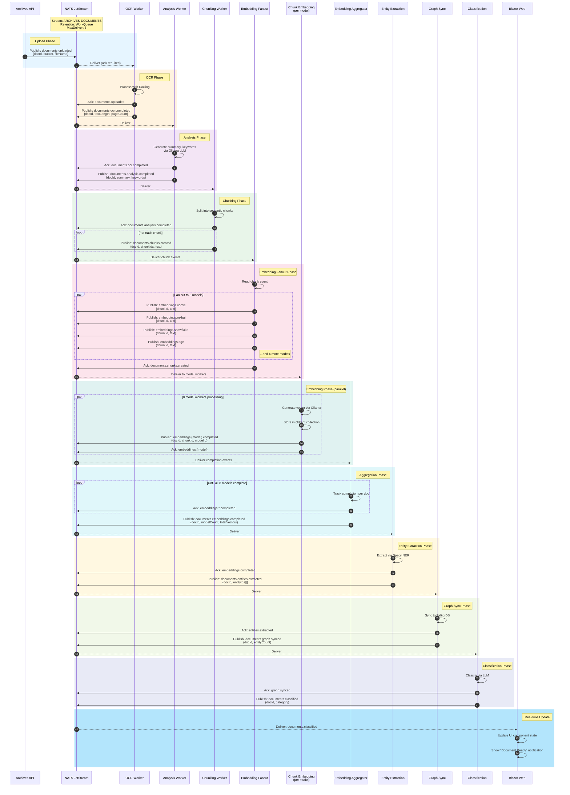
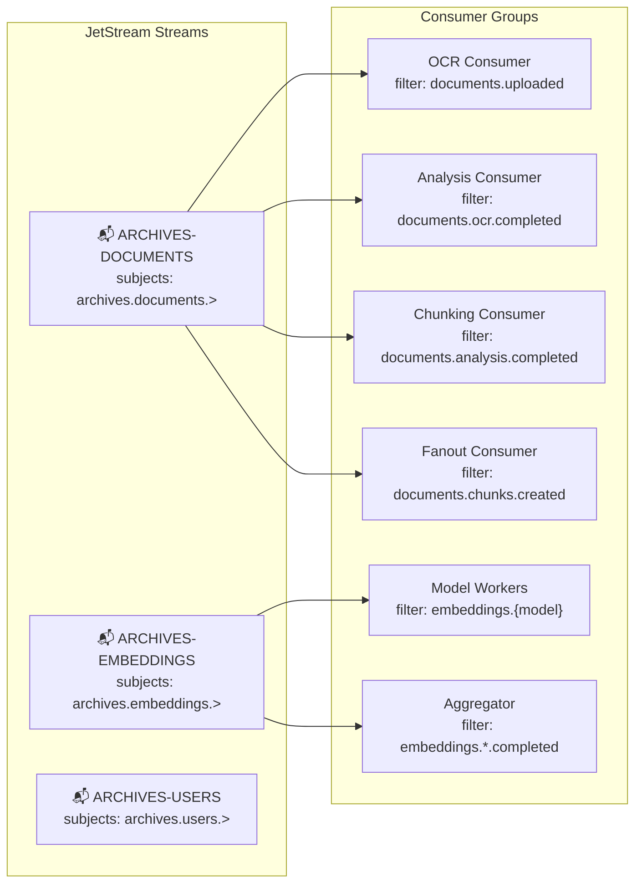
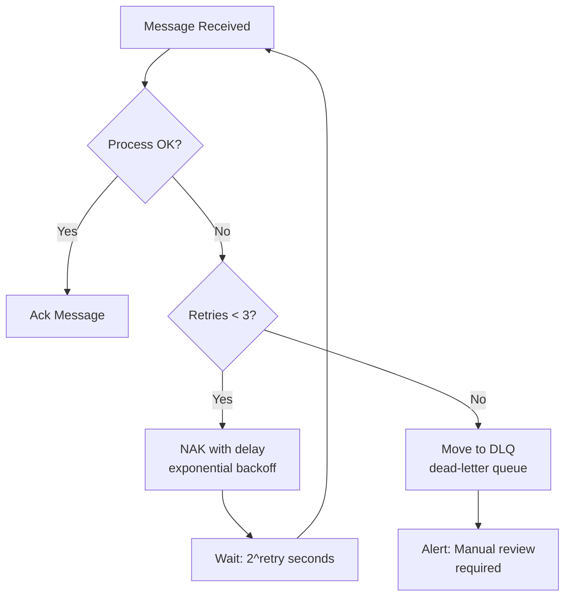

# Event-Driven Architecture

This diagram illustrates how BlueRobin uses NATS JetStream for asynchronous, event-driven document processing with guaranteed delivery.

## Event Flow Sequence

## NATS JetStream Configuration

## Delivery Guarantees

| Feature | Configuration | Purpose |
|---------|--------------|---------|
| **AckPolicy** | Explicit | Manual acknowledgment required |
| **MaxDeliver** | 3 | Retry up to 3 times on failure |
| **AckWait** | 30s | Time to process before redelivery |
| **DeliverPolicy** | All | Start from beginning on new consumer |
| **ReplayPolicy** | Instant | Process as fast as possible |
| **MaxAckPending** | 1000 | Backpressure control |

## Error Recovery Pattern

## Benefits of Event-Driven Design

1. **Loose Coupling**: Workers don't know about each other
2. **Scalability**: Add worker replicas independently
3. **Resilience**: Failed steps don't block pipeline
4. **Observability**: Events provide audit trail
5. **Flexibility**: Easy to add new processing steps
