# Kubernetes Deployment Architecture

This diagram shows the BlueRobin deployment topology on a K3s cluster, including namespace organization, service communication, and infrastructure components.

## Cluster Overview

```mermaid
flowchart TB
    subgraph Internet["🌐 Internet"]
        User[("👤 User")]
        GitHub["GitHub<br/>(Webhooks)"]
    end

    subgraph Cluster["K3s Cluster (bluerobin-local)"]
        subgraph Gateway["🚪 Gateway Layer"]
            Traefik["Traefik Ingress<br/>*.bluerobin.local"]
            CertManager["cert-manager<br/>Let's Encrypt"]
        end

        subgraph Auth["🔐 Auth Layer"]
            Authelia["Authelia<br/>OIDC Provider<br/>auth.bluerobin.local"]
        end

        subgraph AppsProd["📦 archives-prod"]
            direction TB
            WebProd["Archives Web<br/>Blazor Server<br/>replicas: 2"]
            APIProd["Archives API<br/>FastEndpoints<br/>replicas: 2"]
            WorkersProd["Archives Workers<br/>BackgroundService<br/>replicas: 1"]
        end

        subgraph AppsStaging["📦 archives-staging"]
            direction TB
            WebStaging["Archives Web<br/>(staging)"]
            APIStaging["Archives API<br/>(staging)"]
            WorkersStaging["Archives Workers<br/>(staging)"]
        end

        subgraph DataLayer["💾 data-layer (Shared)"]
            direction TB
            
            subgraph Databases["Databases"]
                PG["PostgreSQL<br/>CNPG Cluster<br/>3 instances"]
                PGBouncer["PgBouncer<br/>Connection Pool"]
                Qdrant["Qdrant<br/>Vector DB"]
                FalkorDB["FalkorDB<br/>Graph DB"]
            end

            subgraph Storage["Storage"]
                MinIO["MinIO<br/>Object Storage<br/>SSE-KMS"]
                KES["KES<br/>Key Server"]
            end

            subgraph Messaging["Messaging"]
                NATS["NATS JetStream<br/>3 replicas"]
            end
        end

        subgraph AI["🤖 ai"]
            direction TB
            Ollama["Ollama<br/>GPU Node<br/>8 embedding models"]
            Docling["Docling OCR<br/>PDF extraction"]
            Spacy["Spacy NER<br/>Entity extraction"]
        end

        subgraph Platform["⚙️ platform"]
            direction TB
            Flux["Flux CD<br/>GitOps"]
            SigNoz["SigNoz<br/>Observability"]
            Infisical["Infisical<br/>Secrets"]
            ARC["Action Runner<br/>Controller"]
        end
    end

    User -->|HTTPS| Traefik
    GitHub -->|Webhooks| Traefik
    Traefik -->|TLS| CertManager
    Traefik -->|/| WebProd
    Traefik -->|/api| APIProd
    Traefik -->|auth.*| Authelia

    WebProd -->|REST| APIProd
    WebProd -->|OIDC| Authelia
    APIProd -->|OIDC| Authelia

    APIProd -->|SQL| PGBouncer
    APIProd -->|gRPC| Qdrant
    APIProd -->|S3| MinIO
    APIProd -->|Pub/Sub| NATS
    APIProd -->|HTTP| Ollama
    APIProd -->|Cypher| FalkorDB

    WorkersProd -->|Consume| NATS
    WorkersProd -->|SQL| PGBouncer
    WorkersProd -->|gRPC| Qdrant
    WorkersProd -->|S3| MinIO
    WorkersProd -->|HTTP| Ollama
    WorkersProd -->|HTTP| Docling
    WorkersProd -->|HTTP| Spacy
    WorkersProd -->|Cypher| FalkorDB

    PGBouncer --> PG

    MinIO -.->|Keys| KES

    Flux -->|Deploy| AppsProd
    Flux -->|Deploy| AppsStaging
    ARC -->|Build| AppsProd

    style Gateway fill:#e3f2fd
    style Auth fill:#fff3e0
    style AppsProd fill:#e8f5e9
    style AppsStaging fill:#f3e5f5
    style DataLayer fill:#fce4ec
    style AI fill:#fff8e1
    style Platform fill:#e0f2f1
```

## Network Topology

## Resource Allocation

## Namespace Purpose

| Namespace | Purpose | Environment Isolation |
|-----------|---------|----------------------|
| `archives-prod` | Production workloads | Prod databases, buckets |
| `archives-staging` | Staging workloads | Staging databases, buckets |
| `data-layer` | Shared infrastructure | Per-env prefixes |
| `ai` | AI/ML services | Shared models |
| `platform` | Platform services | N/A |
| `flux-system` | GitOps controller | N/A |
| `cert-manager` | TLS certificates | N/A |

## High Availability Configuration

| Component | Replicas | HA Strategy |
|-----------|----------|-------------|
| PostgreSQL | 3 | CNPG streaming replication |
| NATS | 3 | Clustered JetStream |
| Archives API | 2 | Load balanced |
| Archives Web | 2 | Session affinity |
| Workers | 1 | Single consumer per queue |
| Qdrant | 1 | Persistent volume |
| Ollama | 1 | GPU singleton |

## Service Discovery

All services use Kubernetes DNS (CoreDNS):
- Pattern: `{service}.{namespace}.svc.cluster.local`
- Example: `nats.data-layer.svc.cluster.local:4222`
