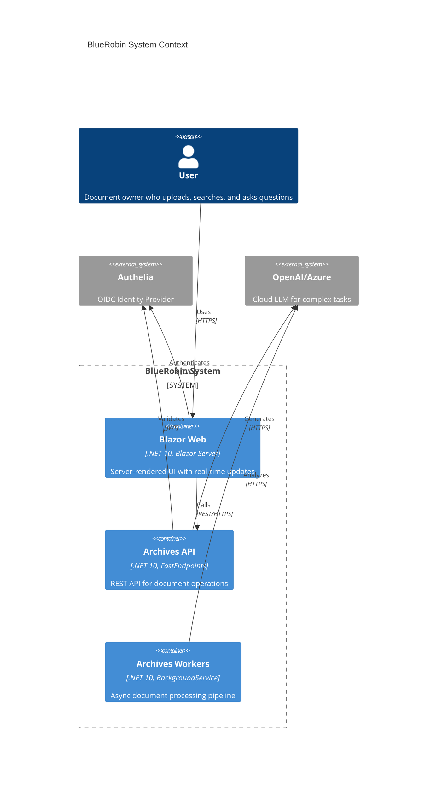
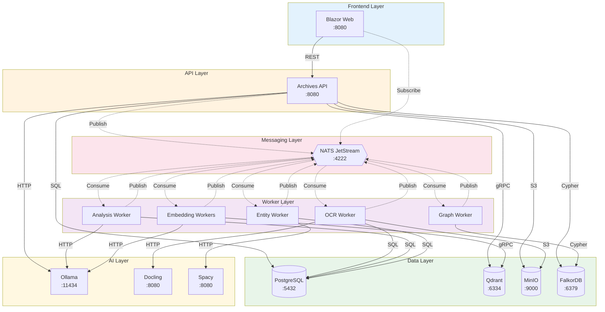
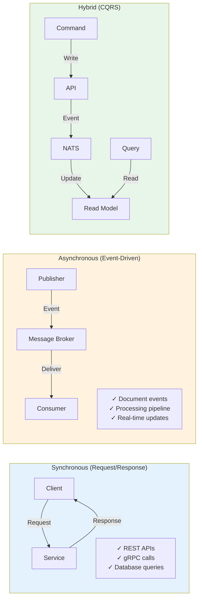
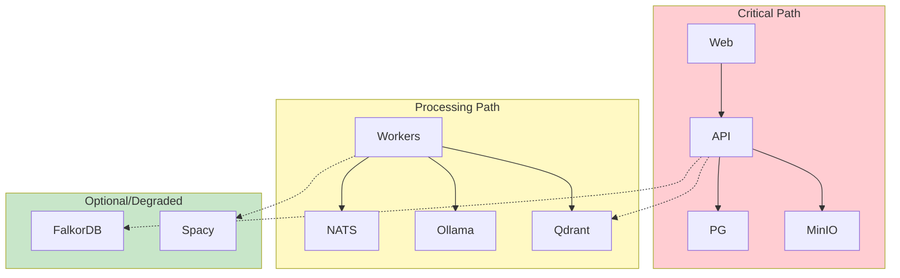

# Microservices Communication

This diagram shows how BlueRobin services communicate with each other, including synchronous API calls and asynchronous event-driven messaging.

## C4 Container View

## Service Communication Matrix

## Protocol Details

| Source | Target | Protocol | Port | Purpose |
|--------|--------|----------|------|---------|
| Web → API | REST | HTTPS | 8080 | Document CRUD, RAG queries |
| Web → NATS | NATS | TCP | 4222 | Real-time notifications |
| API → PostgreSQL | Npgsql | TCP | 5432 | Metadata persistence |
| API → Qdrant | gRPC | HTTP/2 | 6334 | Vector search |
| API → MinIO | S3 | HTTPS | 9000 | File storage |
| API → Ollama | HTTP | TCP | 11434 | Embeddings, LLM |
| Workers → NATS | NATS | TCP | 4222 | Event consumption |
| Workers → Docling | HTTP | TCP | 8080 | OCR extraction |
| Workers → Spacy | HTTP | TCP | 8080 | NER extraction |
| Workers → FalkorDB | Cypher | TCP | 6379 | Graph queries |

## Communication Patterns

## Service Dependencies

## Resilience Patterns

| Pattern | Implementation | Service |
|---------|---------------|---------|
| **Circuit Breaker** | Polly | API → External services |
| **Retry with Backoff** | NatsEventConsumerBase | Workers |
| **Bulkhead** | Semaphore limits | Embedding workers |
| **Timeout** | HttpClient timeout | All HTTP calls |
| **Health Checks** | ASP.NET Health | All services |
| **Graceful Degradation** | Optional features | Graph queries |
