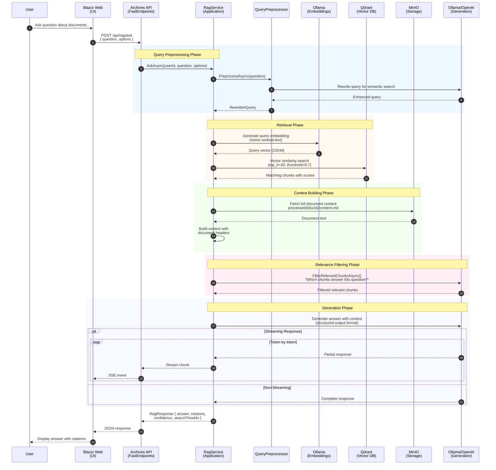

# RAG Query Pipeline

This diagram illustrates how BlueRobin processes user questions using the RAG (Retrieval Augmented Generation) pattern, combining semantic search with LLM generation.

## Sequence Diagram

## Component Responsibilities

| Component | Role | Technology |
|-----------|------|------------|
| **Blazor Web** | User interface for chat | .NET 10, Blazor Server |
| **Archives API** | REST endpoint handling | FastEndpoints |
| **RagService** | Orchestration layer | Application Service |
| **QueryPreprocessor** | Query optimization | LLM-based rewriting |
| **Ollama** | Embedding generation | nomic-embed-text model |
| **Qdrant** | Vector similarity search | gRPC, HNSW index |
| **MinIO** | Document content retrieval | S3 API |
| **LLM** | Answer generation | Ollama (local) or OpenAI (cloud) |

## Key Design Decisions

1. **Query Preprocessing**: Rewrites user questions for better semantic matching
2. **Multi-phase Retrieval**: Embed → Search → Filter → Generate
3. **Chunk-level Relevance Filtering**: LLM validates which chunks actually answer the question
4. **Streaming Support**: Real-time response display for better UX
5. **Citation Tracking**: Links answers back to source documents
