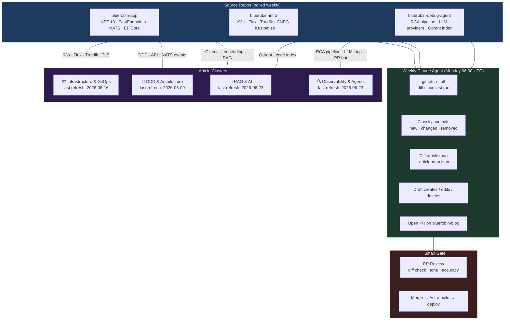

# About BlueRobin

BlueRobin is a homelab where I build production-grade AI on self-hosted infrastructure — and write about every decision along the way. It began with one question and grew into **two projects** that now run side by side on the same cluster.

## Two projects

### The Archives — document intelligence

It started in 2022 with a frustrating question: *"Why does it take so long to find anything in my family's medical records?"* Years of lab results, doctor's notes, prescriptions and imaging reports had piled up, and searching by filename was useless for medical content.

The Archives is the answer: upload any document, ask any question, and get an answer cited directly from your own archive. Under the hood it's a complete pipeline — OCR and structure extraction, named-entity recognition into a knowledge graph, multi-model vector search, and retrieval-augmented generation that answers in plain language with citations to the exact source paragraphs.

### The Debug Agent — autonomous root-cause analysis

Running the Archives in production created a second problem: when something broke at 2 a.m., *I* was the on-call engineer. The Debug Agent is the answer to that — an LLM agent that investigates incidents on its own.

It traverses a graph world-model of the whole platform, ranks likely causes with correlation-first scoring, runs a bounded tool-using investigation against real observability data, and only opens a pull request when hard evidence supports it. It's deliberately advisory: a human always merges. The interesting parts — a persistent graph, an externalized verification gate, and bi-temporal incident memory — are written up as papers in the [Debug Agent](/debug-agent/) section.

## The journey

**Phase 1 — Cloud-first (2022).** Like many developers, I started on managed cloud services. It worked, but the monthly bill for AI features climbed fast. For a personal project, that felt excessive.

**Phase 2 — The homelab pivot (2023).** I had a server collecting dust. Moving everything local forced honest thinking about resource constraints — which, it turned out, led to better architecture: lightweight Kubernetes (k3s), GitOps with Flux, and a service mesh for mTLS.

**Phase 3 — AI integration (2024–2025).** Accessible LLMs changed what was possible: local OCR, local embeddings, a real RAG pipeline, and a hybrid model strategy that keeps cost under a strict monthly ceiling.

**Phase 4 — The agent (2025–2026).** With the platform stable, the focus shifted from *building* the system to *operating* it — and to teaching an agent to debug it. That's the Debug Agent.

## The platform

| Component | Technology | Why |
|-----------|------------|-----|
| Frontend | Blazor Server | Real-time UI, C# everywhere |
| API | FastEndpoints | High-performance, clean contracts |
| Messaging | NATS JetStream | Lightweight, durable, KV store |
| Database | PostgreSQL | Relational metadata + lifecycle |
| Vectors | Qdrant | Multi-model semantic search |
| Graph | FalkorDB | Entity & world-model graphs |
| Inference | Ollama + Claude | Local-first, gateway for the rest |
| Orchestration | k3s + Flux | GitOps on a homelab cluster |

Everything runs under a strict cost ceiling — the constraint that shapes nearly every design decision on this blog.

## Why this blog

A few years of building and operating BlueRobin taught me patterns I wish I'd known earlier: Domain-Driven Design in a real .NET codebase, event-driven architecture with NATS, GitOps with Flux, practical RAG, and — most recently — how to make an LLM agent reason about failures without letting it hallucinate a fix. This blog documents those learnings with **real code** and **honest evaluation** from a **production system**.

## How this blog is generated

The articles here aren't written from scratch in isolation — they're driven by real changes to the BlueRobin codebase.

A weekly scheduled Claude agent wakes up every Monday, pulls the latest commits from `bluerobin-app`, `bluerobin-infra`, and `bluerobin-debug-agent`, and runs a diff-aware analysis to decide which articles need to be created, updated, or retired. It uses the same tool-using ReAct loop as the Debug Agent, but pointed at GitHub instead of Grafana.

The job does three things:

1. **Classifies commits** — new features generate draft post candidates; API or schema changes trigger updates to posts that reference them; removed services mark the corresponding posts as superseded with a notice at the top.
2. **Diffs the article map** — a commit-to-article mapping in `.article-map.json` tracks which areas of the codebase each post covers. The agent walks the changed paths and finds every article with a matching coverage entry.
3. **Opens a PR** — proposes creates, edits, and deletes as a single pull request. I review the diff, adjust tone where the agent is too terse or too thorough, and merge.

The diagram below shows the current source-to-article mapping and when each cluster was last refreshed by the job:

The agent doesn't auto-merge — every proposed change goes through a pull request I review. The interesting failures happen when a single commit touches three article clusters simultaneously (a refactor that changes the DDD model, the NATS schema, and the Kubernetes deployment in one go). The agent usually gets the create/delete decisions right but sometimes misses a cross-cutting update. That's what the review step is for.

## About me

I'm **Victor Robin**. BlueRobin is my playground for the patterns I don't always get to use elsewhere: DDD, event-driven design, LLM integration, graph reasoning, and homelab DevOps. The best way to learn is to build; the second best is to teach. This blog is both.

---

*Questions, or want to compare notes on any of this? Reach out on [LinkedIn](https://www.linkedin.com/in/dr-victor-robin/).*
